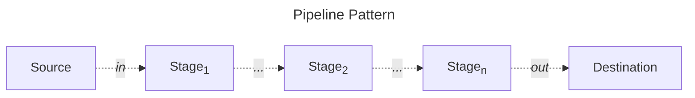
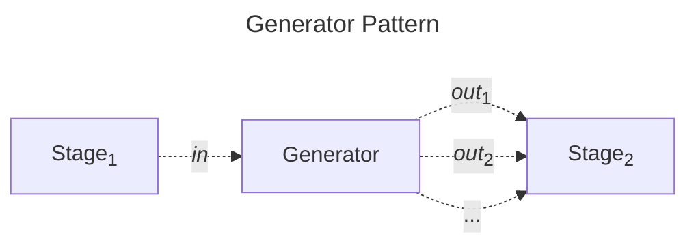
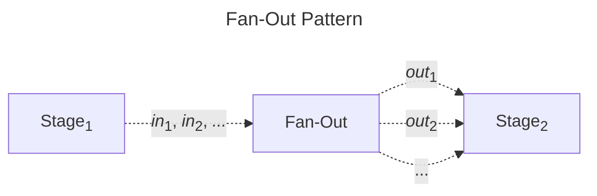
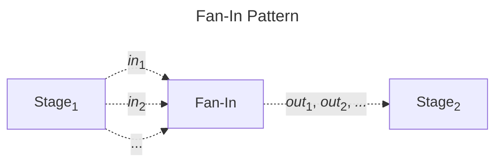
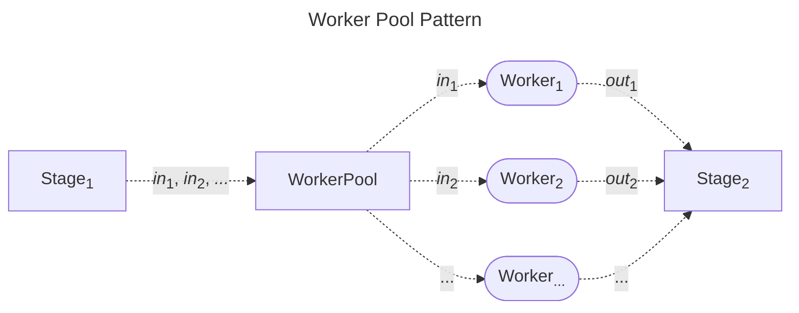

# Go Concurrent Patterns

## A Demo Example of Applying Practical Concurrent Patterns

This project is an exercise example of demonstrating the implementation of various concurrent patterns in Go. These patterns include the **Generator Pattern**, **Fan-in/Fan-out Pattern**, **Pipeline Pattern**, and **Worker Pool Pattern**.

In this naïve web scrapping example, we demonstrate the usage of several concurrent patterns:

- **Pipeline Pattern** (`generateURLs`, `fetchURL`, `processResponses`, `processHTML`, and `workerPool`): `generateURLs` performs staged processing on the extraction of the URLs. `fetchURL` and `processResponses` perform staged processing on collecting and merging data from the source. `processHTML` performs staged processing on HTML content by extracting relevant information, formatting it for further processing. `workerPool` manages the staged processing of HTML content.
- **Generator Pattern** (`generateURLs`): The `generateURLs` function serves as a source for generating URLs to be visited. It parses HTML content, extracting URLs from hyperlinks, and provides a continuous stream of URLs for visiting.
- **Fan-in/Fan-out Pattern** (`fetchURL` and `processResponses`): The `fetchURL` function concurrently fetches HTML content from multiple URLs, while `processResponses` collects and merges this fetched HTML content from various sources. These patterns enable the concurrent execution of multiple independent tasks and efficient collection of their results.
- **Worker Pool Pattern** (`workerPool`): `workerPool` manages a pool of worker goroutines for concurrent processing of HTML content. It distributes incoming HTML content among worker goroutines, enhancing processing throughput.

The book [Concurrency in Go](https://www.oreilly.com/library/view/concurrency-in-go/9781491941294/) introduces several good practices for using goroutines and channels in Go and applies them to formulate practical concurrent patterns. These patterns are later well-structured and refined in community posts. In this project, we provide a basic overview of some patterns and intentionally orchestrate them to build a rudimentary web scraper application for explanatory purposes. Additionally, a few good practices widely used in my daily projects as side notes are included. Referring to the book for a complete rationale and advantages of applying these practices is highly recommended.

### Pipeline Pattern

The Pipeline Pattern facilitates a series of operations by constructing and executing consecutive flows in a structured and sequential manner. Each operation in this process is referred to as a stage of the pipeline. Every individual stage takes in data, performs a transformation on it, and outputs the transformed data.



In Go, we can implement the Pipeline Pattern by constructing a series of functions that have the properties of a pipeline stage, and then we are able to combine them to form a pipeline. The properties of a pipeline stage are:

- A stage consumes and returns the same type.
- A stage must be reified by the language so that it may be passed around.

```go
func main() {
	//...

	// Generate URLs from entry URLs
	urlChannel := generateURLs(ctx, entryURLs...)

	// Fetch HTML content from URLs
	numWorkers := runtime.NumCPU()
	fetchedChannels := make([]<-chan string, numWorkers)
	for i := 0; i < numWorkers; i++ {
		fetchedChannels[i] = fetchURL(ctx, urlChannel)
	}

	// Collect and merge HTML content from multiple channels
	processedHTML := processResponses(ctx, fetchedChannels)

	// Process HTML content
	processedData := processHTML(ctx, processedHTML)

	// Worker pool for processing HTML content
	numWorkerPool := 2
	finalResult := workerPool(ctx, processedData, numWorkerPool)

	//...
}
```

> <I>In a nutshell, in the Pipeline Pattern, we use a range statement to extract values. Each stage can be executed concurrently because the inputs and outputs are designed to be safe in concurrent contexts.</I>

### Generator Pattern

A generator is a routine that can be used to control the iteration behavior of a loop. Conceptually, a generator allows for the generation of a sequence of values, which can then be processed asynchronously as they become available. This enables the efficient processing of potentially infinite streams of data by producing elements lazily, on demand.



In Go, the generator can be implemented as a function which takes in a variadic slice of values, constructs a channel of values to the incoming slice, starts a goroutine, and returns the constructed channel. Then, on the goroutine that was created, generator ranges over the variadic slice that was passed in and sends the slices’ values on the channel it created.

```go
func generateURLs(ctx context.Context, entryURLs ...string) <-chan string {
	out := make(chan string)
	go func() {
		defer close(out)
		// ...

		generate := func(ctx context.Context) {
			for {
				select {
				case <-ctx.Done():
					return
				case url := <-queue:
					// ...
					for _, u := range extractURLs(string(body)) {
						// ...
							select {
							case <-ctx.Done():
								return
							case out <- u:
								// ...
								queue <- u
						// ...
					}
				}
			}
		}
		
		generate(ctx)
	}()
	return out
}
```

> **NOTE**:
In this function, we use a pattern (the send on the channel shares a `select` statement with a selection on the `Context.Done()` channel) to "prevent goroutine leaks" by taking in a channel to signal when the goroutine should exit.

> <I>In a nutshell, the generator function converts a discrete set of values into a stream of data on a channel.</I>

### Fan-in/Fan-out Pattern

The Fan-In/Fan-Out Pattern is a concurrency pattern used to concurrently execute multiple independent operations (Fan-Out) and merge their results into a single stream (Fan-In). This pattern is particularly useful when there is a large number of independent tasks that can be executed concurrently and then need to combine their results.

> **NOTE**:
Fan-out is a term to describe the process of starting multiple goroutines to handle input from the pipeline, and fan-in is a term to describe the process of combining multiple results into one channel.

> **NOTE**:
In the Fan-In/Fan-Out pattern, the order of concurrent tasks is irrelevant.





In Go, this pattern is commonly implemented using goroutines and channels. The Fan-Out phase distributes tasks to multiple worker goroutines, each producing its own output. The outputs are then collected and merged by another goroutine in the Fan-In phase.

```go
// Fan-out pattern
func fetchURL(ctx context.Context, urls <-chan string) <-chan string {
	out := make(chan string)
	go func() {
		defer close(out)
		for url := range urls {
			select {
			case <-ctx.Done():
				return
			default:
				// ...
				out <- string(body)
			}
		}
		close(out)
	}()
	return out
}

// Fan-in pattern
func processResponses(ctx context.Context, responses []<-chan string) <-chan string {
	var wg sync.WaitGroup
	out := make(chan string)

	output := func(c <-chan string) {
		defer wg.Done()
		for resp := range c {
			select {
			case <-ctx.Done():
				return
			default:
				out <- resp
			}
		}
	}

	wg.Add(len(responses))
	for _, c := range responses {
		go output(c)
	}

	go func() {
		wg.Wait()
		close(out)
	}()

	return out
}
```

> <I>In a nutshell, fanning in involves creating the multiplexed channel consumers will read from, and then spinning up one goroutine for each incoming channel, and one goroutine to close the multiplexed channel when the incoming channels have all been closed.</I>

### Worker Pool Pattern

The Worker Pool Pattern is a concurrency design pattern used to manage a group of workers that process upstream tasks concurrently. By limiting the number of active workers and queuing incoming tasks, the Worker Pool Pattern prevents resource contention and overloading the system, thereby improving performance and stability.



In Go, we can implement the Worker Pool Pattern by using an inbound channel to receive incoming values. Each incoming value triggers a goroutine (worker) to process the result and send the processed output to an outbound channel. Ideally, the number of workers can be set to match the number of logical CPUs available to the current process, but it can also be adjusted according to specific requirements.


```go
func workerPool(ctx context.Context, in <-chan string, numWorkers int) <-chan string {
	out := make(chan string)
	var wg sync.WaitGroup

	for i := 0; i < numWorkers; i++ {
		wg.Add(1)
		go func() {
			defer wg.Done()
			for {
				select {
				case <-ctx.Done():
					return
				case html, ok := <-in:
					// ...
					out <- processedHTML
				}
			}
		}()
	}

	go func() {
		wg.Wait()
		close(out)
	}()

	return out
}
```

In a nutshell, the worker pool manager can be implemented by creating a pool of goroutines to process tasks from a shared queue, which is typically represented by an inbound channel.

## Usage

To run the process, execute the following commands in the terminal:

```bash
cd cmd/
go run main.go
```
You will see the output similar to:
```
2024/04/29 23:47:40 generate URL = https://creativecommons.org/licenses/by-sa/4.0/deed.en
2024/04/29 23:47:40 fetch URL = https://creativecommons.org/licenses/by-sa/4.0/deed.en
2024/04/29 23:47:40 fetch URL = https://donate.wikimedia.org/wiki/Special:FundraiserRedirector?utm_source=donate&amp;utm_medium=sidebar&amp;utm_campaign=C13_en.wikipedia.org&amp;uselang=en
2024/04/29 23:47:40 generate URL = https://donate.wikimedia.org/wiki/Special:FundraiserRedirector?utm_source=donate&amp;utm_medium=sidebar&amp;utm_campaign=C13_en.wikipedia.org&amp;uselang=en
2024/04/29 23:47:40 generate URL = https://www.wikidata.org/wiki/Special:EntityPage/Q5296
2024/04/29 23:47:40 generate URL = https://commons.wikimedia.org/wiki/Main_Page
2024/04/29 23:47:40 generate URL = https://foundation.wikimedia.org/wiki/Home
2024/04/29 23:47:40 generate URL = https://www.mediawiki.org/wiki/MediaWiki
2024/04/29 23:47:40 generate URL = https://meta.wikimedia.org/wiki/Main_Page
2024/04/29 23:47:40 generate URL = https://outreach.wikimedia.org/wiki/Main_Page
2024/04/29 23:47:40 fetch URL = https://outreach.wikimedia.org/wiki/Main_Page
2024/04/29 23:47:40 fetch URL = https://commons.wikimedia.org/wiki/Main_Page
2024/04/29 23:47:40 fetch URL = https://www.mediawiki.org/wiki/MediaWiki
2024/04/29 23:47:40 fetch URL = https://foundation.wikimedia.org/wiki/Home
2024/04/29 23:47:40 fetch URL = https://www.wikidata.org/wiki/Special:EntityPage/Q5296
2024/04/29 23:47:40 fetch URL = https://meta.wikimedia.org/wiki/Main_Page
2024/04/29 23:47:41 fetch URL = https://wikisource.org/wiki/Main_Page
2024/04/29 23:47:41 generate URL = https://wikisource.org/wiki/Main_Page
2024/04/29 23:47:41 fetch URL = https://species.wikimedia.org/wiki/Main_Page
2024/04/29 23:47:41 generate URL = https://species.wikimedia.org/wiki/Main_Page
2024/04/29 23:47:41 fetch URL = https://en.wikibooks.org/wiki/Main_Page
2024/04/29 23:47:41 generate URL = https://en.wikibooks.org/wiki/Main_Page
2024/04/29 23:47:41 processed HTML = {"title":"MediaWiki is a collaboration and documentation platform brought to you by a vibrant community.","author":"","date":"","category":"","content":""}
2024/04/29 23:47:41 processed HTML = {"title":"Main Page","author":"","date":"","category":"","content":""}
...
```